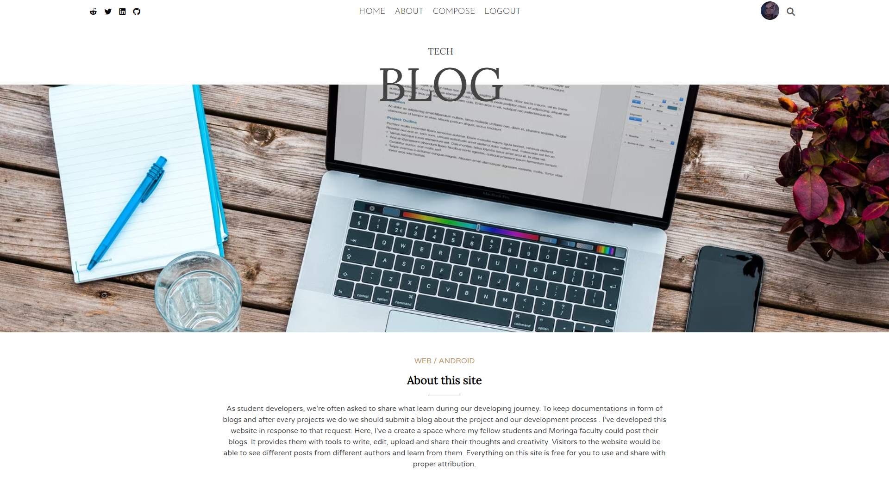

# Tech Blog

## By Maurice Nganga

### Tech Blog landing page

## Table of Content

- [Description](#description)
- [Features](#features)
- [Development](#development)
- [Live Link](#live-link)
- [Setup Instructions and Technology](#technology-used)
- [License](#license)

## Description

---

Tech blog is a web application meant to be used in an institution to allow students, technical mentors or any person in the organisation to write, edit, read and post aritcles about a topic they are interested in. The website is ment to provide a platform where each member of the institution can share their ideas and interests with the other members of the institution creating an interactive environment and bring people together. A visitor to the website can browse and read any article or search on articles by author name or categories. A registered user are further provided with tools to create, upload, edit and delete thier own articles. This is a blog website with a front-end made using react and a backend made with node and mongoDB. The front-end is diployed in [vercel](https://vercel.com/) hosting service while the db.json is hosted in [heroku](https://heroku.com/).

## Features

---

A user visiting this page would be able to see:

1. A home page populated with posts from different writers.

2. A top navigation section with links to register or login for a new user and a link to compose page for a registed user.

3. A user can select a post by clicking on the title and this will enable to read the full article in a single separate page

4. For a user they can visit the compose page and they are provided with tools to write, edit, upload and post an article in any topic they are interested in.

5. A registered user are future provided with tools to edit or delete their own post when they select their own posts and be redirected to the single page.

6. A settings [age where they can edit thier profil, upload a profile or delete their own profile.

7. A viitor to the website can select a post depending on the author or categegory they are interested in by clicking on the author name or category list.

### Technology Used

---

- Used Visual Studio Code editor to create the front-end with _**React**_ and backend with _**db.json**_

- **Styled-components** - was used to create the structure and the styling of the website.

- **Firebase** - was used to upload images to the website.

- **Context-Api** - was used to help persist a user across all pages in the website and enable them with accessibility privilages.

- **React** - help in creating interactive website

---

## Development

---

Want to contribute? Excellent!

To enhance or contribute on the existing project, follow these steps:

- Fork the repo
- Create a new branch (git checkout -b enhance-feature)
- Run npm install
- Make the appropriate changes in the files
- Add changes to reflect the changes made
- Commit your changes (git commit -m 'Enhanced feature')
- Push to the branch (git push origin enhance-feature)
- Create a Pull Request

### Live Link

---

\- Click this link to see the live website [Tech Blog Website](https://tech-blog-moryno.vercel.app/)

## License

---

MIT License

Copyright (c) [2022] [Maurice Nganga]

Permission is hereby granted, free of charge, to any person obtaining a copy
of this software and associated documentation files (the "Software"), to deal
in the Software without restriction, including without limitation the rights
to use, copy, modify, merge, publish, distribute, sublicense, and/or sell
copies of the Software, and to permit persons to whom the Software is
furnished to do so, subject to the following conditions:

The above copyright notice and this permission notice shall be included in all
copies or substantial portions of the Software.

THE SOFTWARE IS PROVIDED "AS IS", WITHOUT WARRANTY OF ANY KIND, EXPRESS OR
IMPLIED, INCLUDING BUT NOT LIMITED TO THE WARRANTIES OF MERCHANTABILITY,
FITNESS FOR A PARTICULAR PURPOSE AND NONINFRINGEMENT. IN NO EVENT SHALL THE
AUTHORS OR COPYRIGHT HOLDERS BE LIABLE FOR ANY CLAIM, DAMAGES OR OTHER
LIABILITY, WHETHER IN AN ACTION OF CONTRACT, TORT OR OTHERWISE, ARISING FROM,
OUT OF OR IN CONNECTION WITH THE SOFTWARE OR THE USE OR OTHER DEALINGS IN THE
SOFTWARE.
